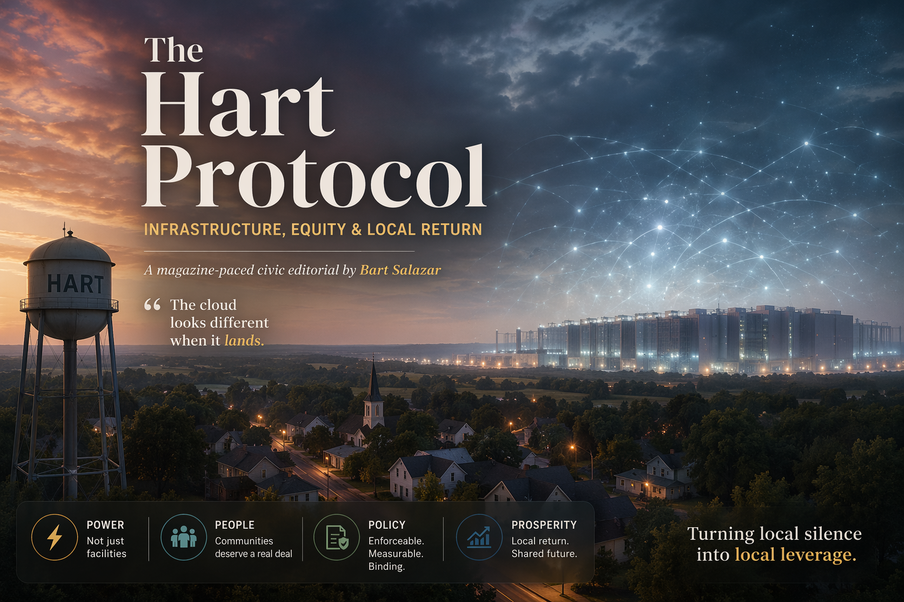

# The Hart Protocol

**Infrastructure, Equity & Local Return**  
*A magazine-paced civic editorial by **Bart Salazar***

> The cloud looks different when it lands.
---

## Live Site

[View the live editorial](https://bartron773.github.io/the-hart-protocol/)

---

## What This Is

*The Hart Protocol* is a single-file, self-contained HTML editorial that reframes the data-center conversation as a question of **public leverage, civic protection, and enforceable local return**.

It is **not anti-tech**. It is a policy-sharp argument that communities asked to host the physical infrastructure of AI, cloud, and digital life deserve a real deal — not just tax rhetoric and landscaping renderings.

Designed with glassmorphism, atmospheric orbs, and film-grain texture, it reads like a high-end print editorial while living natively on the web.

## Why It Matters

Data centers are often discussed as abstract symbols of innovation. For host communities, they are physical systems with real consequences: land use, substations, water demand, zoning pressure, backup generation, and long-term public obligations.

*The Hart Protocol* argues that if digital infrastructure lands locally, local communities should receive visible, enforceable value in return.

## Key Sections

- Opening argument: power, not just facilities
- The numbers: Virginia GDP, polling decline, and efficiency benchmarks
- The smarter deal: six concrete public demands
- Binding Community Benefit Agreements
- Exit liability and decommissioning
- Plain-language framing for neighbors and local stakeholders

## Tech

- Single-file `index.html`
- Pure HTML + CSS
- Responsive layout
- Print-friendly design
- No build step
- No framework dependencies

## Run Locally

1. Clone or download this repository
2. Open `index.html` in any modern browser

## Project Structure

- `index.html` — the full editorial
- `README.md` — project overview

## License

Open to read, share, fork, and adapt. Attribution appreciated.  
A formal license may be added in a future revision.

---

**Conceived, written, and shaped by Bart Salazar**  
Hart, Michigan — April 2026

*The Hart Protocol* — turning local silence into local leverage.
